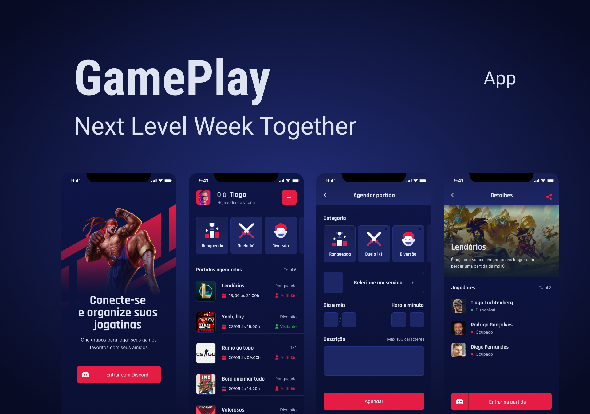

<h3 align="center">
    
    <br>
    <br>
</h3>

<p align="center">
  <a href="https://www.linkedin.com/in/gustavofsa/">
    
  </a>

  

  
</p>

<br/>

---

<br/>

<h3 align="center">
    
    <br>
    <br>
</h3>

## 📖 Sobre

Aplicativo mobile para que jogadores se conectem e organizem suas gameplays. Agende encontros e utilize da autenticação com o Discord para entrar em servidores e se divertir com seus amigos.

<br/>

## :rocket: Tecnologias

- [Typescript](https://www.typescriptlang.org/)
- [React Native](https://reactnative.dev/)
- [Expo](https://expo.io/)

<br/>

## 🤔 Como rodar

<br/>

### **Pré-requisitos**

- É **necessário** possuir o **[Node.js](https://nodejs.org/en/)** instalado na máquina
- Também, é **preciso** ter um gerenciador de pacotes seja o **[NPM](https://www.npmjs.com/)** ou **[Yarn](https://yarnpkg.com/)**.
- Por fim, é **essencial** ter o **[Expo-cli](https://expo.io/)** instalado de forma global na sua máquina e o app **[Expo Go](https://expo.dev/client)** no seu device ou emulador

1. Faça um clone :

```sh
  $ git clone https://github.com/gustavofsa/gameplay.git
```

2. Executando a Aplicação:

```sh
  # Instale as dependências
  $ npm install
  #ou
  $ yarn

  # Inicie a aplicação mobile
  $ expo start
```

Lembre-se de criar o seu App no servidor do Discord para obter as credencias de autenticação. Em seguida, defina no arquivo .env as configurações do seu App (remova o example do arquivo .env.example).

```cl
REDIRECT_URI=
SCOPE=
RESPONSE_TYPE=
CLIENT_ID=
CDN_IMAGE=
```

## 🎯 Desafios

- [x] Criar modal de Sign Out
